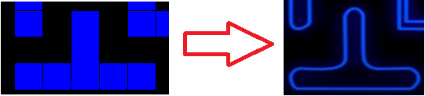
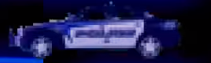
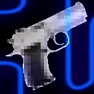
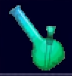
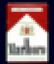
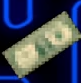
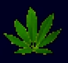
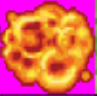
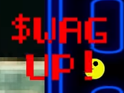
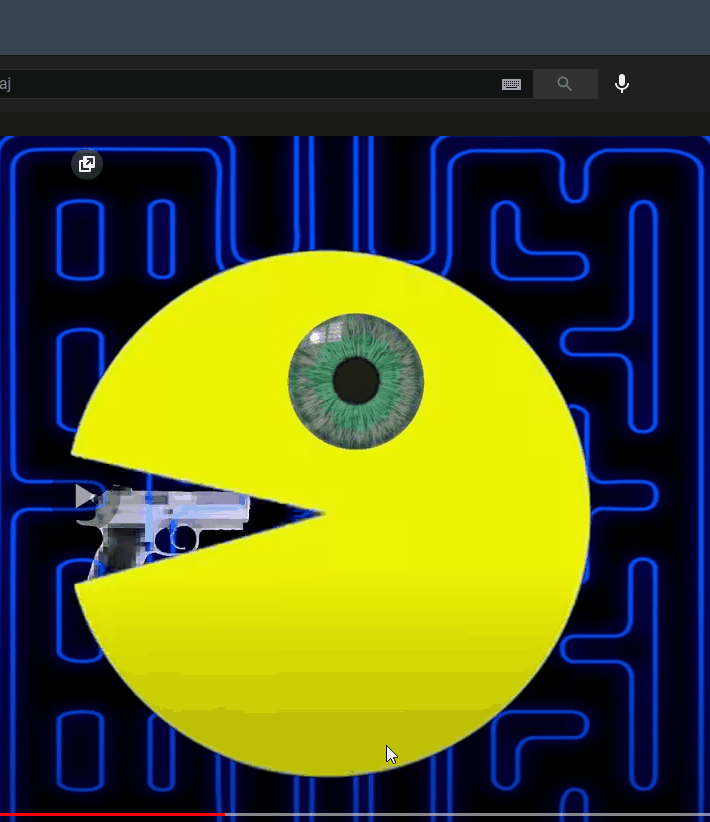

# Further Development

## 1 Remove resizing

We need to get rid of the resize feature because it causes more problems than favors. It was only a requirement for our college project.

## 2 Mappyn

Replace current design/graphics of map (as for now being plain colored squares) with graphics from [this](https://www.youtube.com/watch?v=olE0KiPA-cg&t=128s) video.

We need to have individual images respectively for every square surrounding configuration.

## 3 Replace pause graphics

## 4 Replace graphics

- Pacman
  - 
- Ghost
  - 

- Gun
  - 
- Berries
  - 
- Cherries
  - 
- Balls
  - 
- Hearts
  - 

## 5 Add animations

- Smth after killing a ghost
  - Tribute to [Janusz Buras](https://github.com/janusz-buras/Bomberman/blob/main/src/graphics/ikony.png)
  - 
- After collecting cash
  - 
- After collecting Berries
  - 

## 6 Add 'slowing ghosts collectable item'

With the bongo icon.

