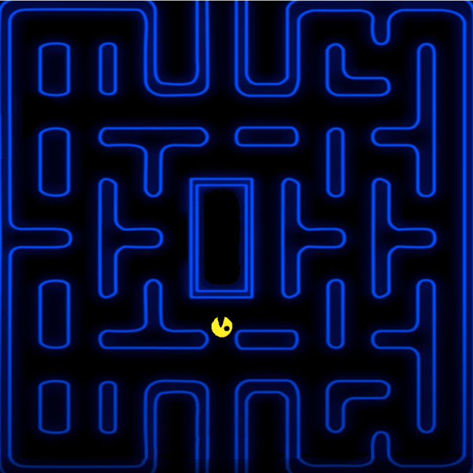

# Pacman

## Zasady gry

W grze sterujemy pacmanem. Celem gry jest zjedzenie wszystkich kulek znajdujących się w labiryncie, co odblokowywuje możliwość przejścia na kolejny poziom. Każdy poziom może wymagać innej liczby kulek do zjedzenia. Po labiryncie mogą poruszać się duszki, które w zetknięciu z nim zabierają mu życie.

## Własne elementy dodatkowe

- kulki nie są umieszczone na każdym polu nie będącym ścianą, a jedynie w wybranych strategicznie miejscach
- pacman ma możliwość zbierania nie tylko kulek przenoszących go na następny poziom, ale również obiektów, które pojawiają się na mapie losowo na jakiś czas po czym znikają. Istnieją 3 rodzaje takich obiektów, każde o innym efekcie w grze:
  - chwilowe zwiększenie prędkości pacmana
  - chwilowe sprawienie, że duszki nie zabijają pacmana
  - umożliwienie pacmanowi wystrzelenie n liczby naboi, które trafione są w stanie zabić duszka
- Wraz z rosnącą liczbą zebranych przez pacmana puntków duszki poruszają się coraz szybciej.

## Szczegółowe zasady punktacji 

Pojedyńcze złapanie kulki przez pacmana, daje liczbę punktów 500/<liczba_kulek_na_poziomie>. Zastrzelenie duszka daje 30 punktów, każde zebranie obiektu zbieralnego - 20 punktów. Przejście poziomu natomiast polega tylko wyłącznie na tym, aby zebrać wymagane kulki, to sprawi, że na środku mapy pojawi się puchar, którego dopiero zebranie przenosi nas na kolejny poziom. Taki mechanizm pozwala przejść poziom z różną liczbą punktów (minimalnie 500). Punkty zebrane z kolejnych poziomów są sumowane i zapisywane do tablicy rekordów, gdy stracimy wszystkie 3 życia.

## Funkcjonalność aplikacji

Uruchamiając aplikację pokazuje nam się główne menu.  Pozwalające wybrać następujące opcje:

- Start game - rozpocznie nową grę od pierwszego poziomu.
- settings - ustawienia gry (na razie przychodzą nam do głowy tylko ustawienia dźwięku)
- highscore - tablica najlepszych wyników
- quit - zamknięcie aplikacji

## Pogląd mapy

## Podgląd menu

